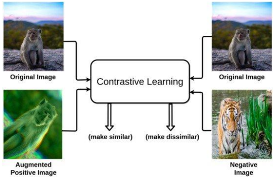

# deep-learning-project
Project for Deep Learning course of Sapienza University of Rome

## Contrastive Learning
Contrastive learning is a machine learning technique used to learn representations without supervision.
This technique can be used as a pre-training step to exploit large amounts of unlabeled data. In this project you will study this technique and: 

1. report on the main ideas and state of the art of contrastive techniques, 
2. implement a contrastive learning regimen for a non-Euclidean data type of your choice (e.g. 3D shapes) and 
3. test experimentally the performance on a task of your choice.

### References 
- [A Survey on Contrastive Self-Supervised Learning](https://www.mdpi.com/2227-7080/9/1/2)
- [Big Self-Supervised Models are Strong Semi-Supervised Learners](https://arxiv.org/abs/2006.10029)